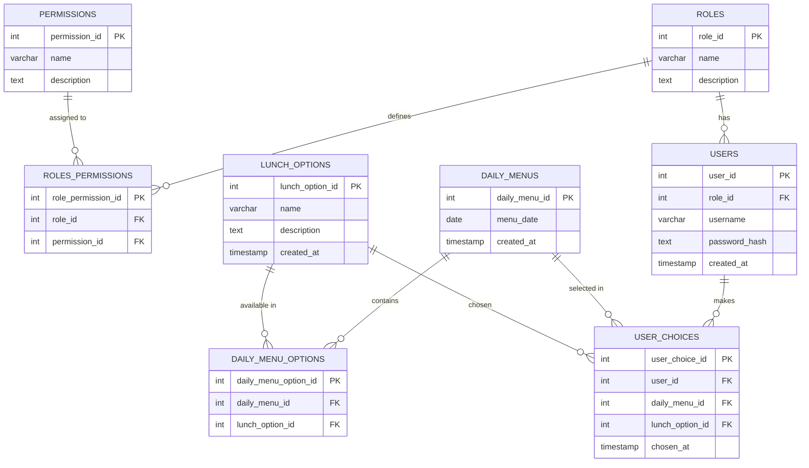

# Office Lunch Menu Management System
## Description
The Office Lunch Menu Management System is a web application designed to streamline the process of managing daily lunch options in an office environment. Admins can easily add and manage daily lunch menus, while employees can view these menus and select their lunch preferences. This system aims to simplify the lunch ordering process and ensure that all employees' choices are recorded efficiently.

## Technologies Used
- Backend: Node.js with Express.js
- Frontend: React.js
- Database: PostgreSQL

## Features for MVP (Minimum Viable Product)

### Admin Interface:
- Add Daily Menu Options: Admins can add new lunch options for specific dates.
- View Employee Choices: Admins can view which employees have chosen which lunch options.

### Employee Interface:
- View Daily Menu: Employees can see the lunch options available for the current day.
- Select Lunch Choice: Employees can select their preferred lunch option from the daily menu.

## Database schema

## Setup instructions for both backend and frontend

### Using Docker

```bash
git clone https://github.com/piru72/office-lunch-menu-management.git
cd office-lunch-menu-management
docker-compose up -d
```

### Using npm
## Instructions on how to run the projects
